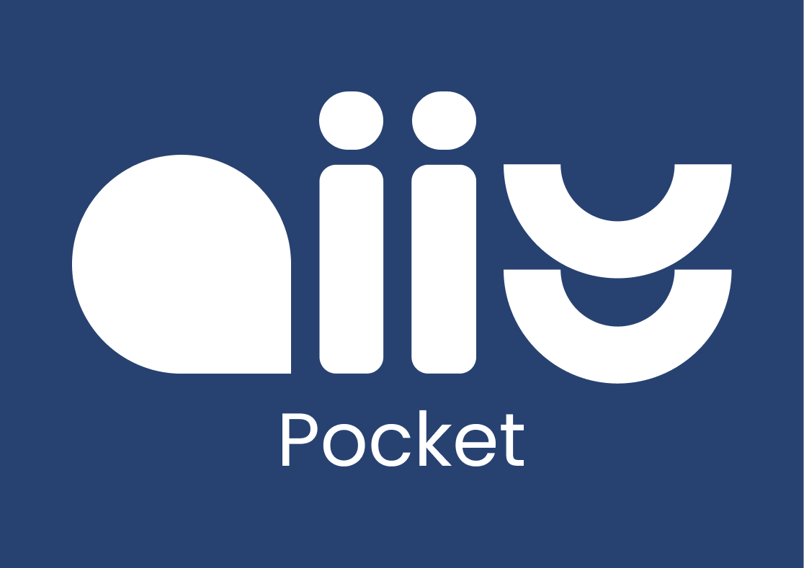

# A11Y

<div align="center">

</div>

O **A11Y** é um projeto desenvolvido durante a disciplina de **Interação Humano-Computador**, ministrada pela professora **Rejane Maria da Costa Figueiredo** na **Universidade de Brasília (UnB)**, ao decorrer do semestre **2025.1**.

Este repositório tem como propósito fornecer um checklist prático de acessibilidade para projetos, principalmente de desenvolvimento de software, que incluem: desenvolvimento web, design, geração de conteúdo e gestão de projetos, além de demonstrar a aplicação de critérios da WCAG em uma página Web.


## Checklist

Este material reúne **itens de verificação (checklist)** com base nas principais referências normativas e diretrizes de acessibilidade digital, incluindo:

- [WCAG 2.2](https://www.w3.org/TR/WCAG22/): Diretrizes de Acessibilidade para Conteúdo Web
- [ABNT NBR 17225:2023](https://mwpt.com.br/wp-content/uploads/2025/04/ABNT-NBR-17225-Acessibilidade-Digital.pdf): Norma brasileira de acessibilidade digital
- [Guia de Boas Práticas para Acessibilidade Digital](https://www.gov.br/governodigital/pt-br/acessibilidade-e-usuario/acessibilidade-digital/guiaboaspraaticasparaacessibilidadedigital.pdf): Publicado pelo Governo do Brasil em cooperação com o Reino Unido

Inclui recursos como:
- Checkboxes com persistência local
- Gráficos em anel para visualização do progresso por nível

Além do checklist, o projeto também inclui uma seleção de **ferramentas úteis** para auxiliar na avaliação e validação da acessibilidade de sites e sistemas.

## Codificação

Também como material da disciplina, foi realizada a codificação de uma página web que aplicasse, principalmente, a diretriz 2.4 da WCAG 2.2: **Operável: Navegação e Consistência**.

---

### Critérios WCAG implementados 

| Critério | Nome                             | Aplicação                                                                 |
|----------|----------------------------------|---------------------------------------------------------------------------|
| 2.4.1    | Contornar blocos                 | Disponibiliza um mecanismo para pular blocos repetitivos                  |
| 2.4.4    | Propósito do link                | Links possuem descrições claras e significativas                          |
| 2.4.6    | Cabeçalhos e rótulos             | Uso consistente e descritivo de títulos e labels                          |

Essa página demonstra a aplicação dessa diretriz de acessibilidade digital em uma página que visa a informar sobre cuidados com suculentas.

---

### Técnicas de programação utilizadas

Para garantir conformidade com os critérios WCAG, foram aplicadas diversas boas práticas de HTML e CSS, incluindo:

- Utilização de **skip links** visíveis ao foco para pular blocos repetitivos
- Definição de regiões da página com **landmarks ARIA** (`role="banner"`, `role="main"`, `role="navigation"`)
- Criação de **links com textos claros e autoexplicativos**
- Uso de **cabeçalhos hierárquicos** consistentes para estruturar o conteúdo
- Associação entre **rótulos de formulário** e seus respectivos campos para facilitar a navegação assistiva
- Estilo de **foco visível** para melhorar a navegação via teclado

Essas abordagens contribuem para um site mais acessível, navegável e acolhedor para todos os perfis de usuário.

---

### Importância e Público-alvo

A acessibilidade digital é um direito previsto em leis como a Lei Brasileira de Inclusão (13.146/2015) e garante que todas as pessoas possam acessar, compreender e interagir com conteúdos online de forma autônoma. Implementar esses critérios não é apenas uma obrigação legal ou acadêmica, mas uma prática ética e inclusiva que amplia o acesso à informação e fortalece a usabilidade da web para todos.

Os critérios aplicados têm como foco melhorar a navegação e compreensão para:

- **Pessoas que usam apenas teclado** para navegar, como usuários com mobilidade reduzida
- **Pessoas que usam leitores de tela**, como pessoas cegas ou com baixa visão
- **Pessoas com deficiência cognitiva**, que precisam de orientação clara e rótulos compreensíveis
- **Todos os usuários**, pois estrutura clara e previsível melhora a usabilidade para qualquer pessoa

---

### Como executar localmente

Para visualizar a implementação frontend do projeto em seu navegador, siga os passos abaixo:


1. **Clone o repositório:**

   ```bash
   git clone https://github.com/UnBIHC2025-1/IHC-2025.1-Grupo07.git
   cd IHC-2025.1-Grupo07/implementacao
   ```


2. **Verifique se o Python está instalado** (versão 3 ou superior) rodando no terminal:
  ```bash
    python --version
  ```


Caso não esteja, baixe em [https://www.python.org/downloads/](https://www.python.org/downloads/).
Caso esteja instalado, siga os passos a seguir:

3. **Inicie um servidor local** com Python:
  ```bash
    python -m http.server 8000
  ```


4. **Abra seu navegador** e acesse:
   ```bash
   http://localhost:8000/implementacao/index.html
   ```


## Equipe

<table>
  <tr>
    <td align="center"><a href="https://github.com/isaqzin"><br /><sub><b>Isaque Camargos</b></sub></a><br />
    <td align="center"><a href="https://github.com/ludmilaaysha"><br /><sub><b>Ludmila Nunes</b></sub></a><br />   
    <td align="center"><a href="https://github.com/mandicrz"><br /><sub><b>Amanda Cruz</b></sub></a><br />   
    <td align="center"><a href="https://github.com/BolzanMGB "><br /><sub><b>Othavio Araujo</b></sub></a><br />
  </tr>
</table>

